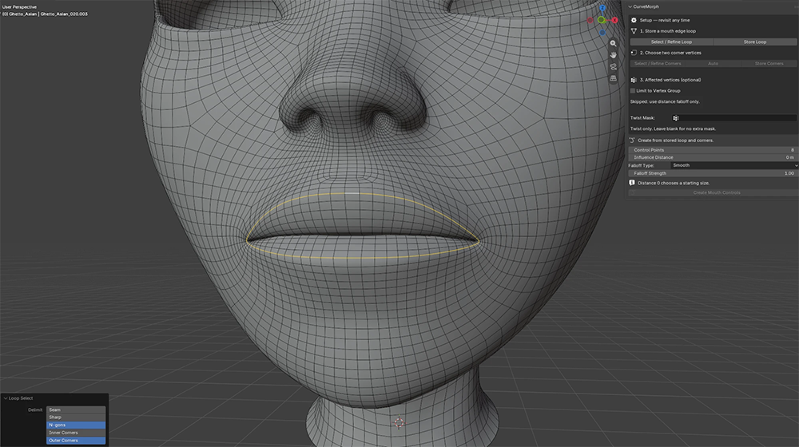
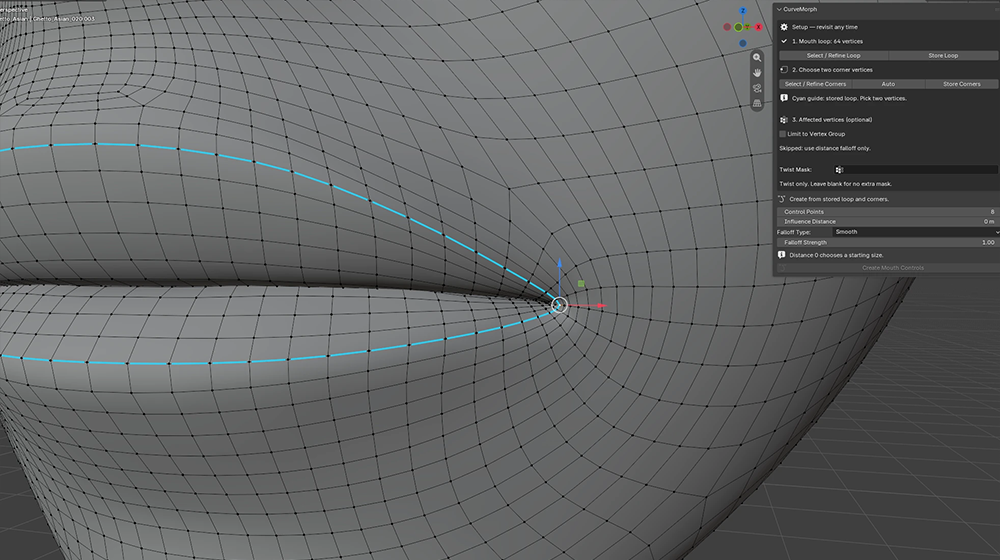
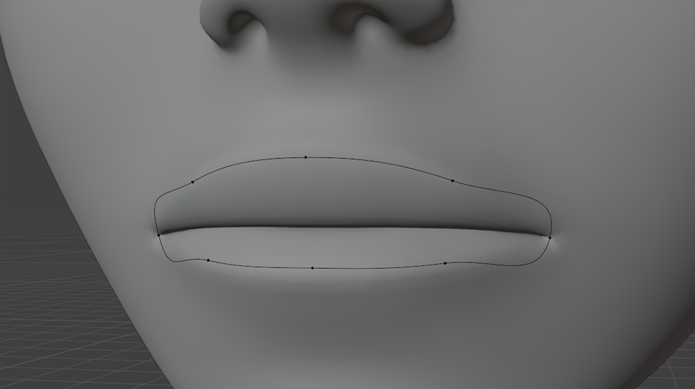
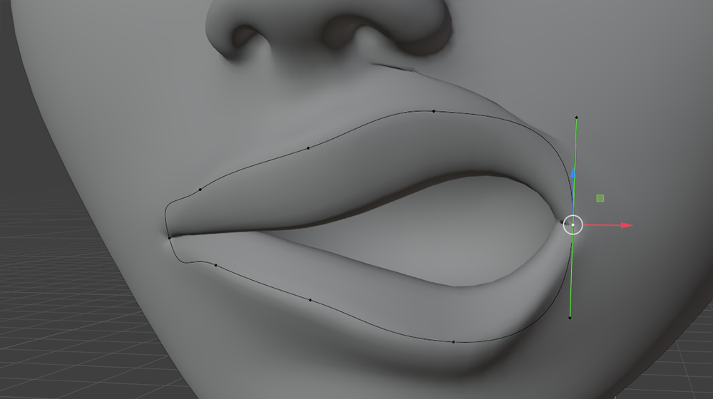

# CurveMorph — Facial Bézier Controls (4.0)

Create multiple independent Bézier controls on one mesh: closed mouth, eye, or
nostril loops and open eyebrow or cheek paths. Pose the whole face and save
expressions as ordinary Blender shape keys. Existing mouth sessions are preserved.

## Install

Download the latest `curvemorph_*.zip` from the
[Releases page](https://github.com/Ephaistophedes/CurveMorph/releases), or build
it yourself with `python tests/package_addon.py`. In Blender Preferences >
Add-ons, use **Install from Disk** and select that zip. Enable **CurveMorph**.
Open the 3D View sidebar (`N`) and select **CurveMorph**. Blender 5.0+ is declared;
runtime tests were run on Blender 5.2.1 LTS.

## Build a face with multiple curves

Use the **CurveMorph** sidebar. There is no fixed limit on
the number of controls per mesh; evaluation cost increases with controls and
affected vertices. Select the character mesh, or choose **Mesh** when importing
Grease Pencil strokes.

1. Switch to **Add Controls**, choose **From: Mesh Edges**, name the feature (for example `Brow.L`), and choose
   its control count and starting influence distance.
2. Click **Select Mesh Edges**. In Edit Mode on the Basis, select exactly one
   connected edge chain or closed loop, then **Create Control**.
   Open/closed detection is automatic. Open paths support 2–64 controls and keep
   both endpoints; closed paths use at least four. Branches, multiple paths, and
   extra selected vertices are rejected. Repeat for each facial feature.
3. The list shows each control's name and optional influence group. Select a row
   and click **Edit Pose** to pose that control using `G`, native handles (`V`), and
   tilt (`Ctrl+T`). All enabled controls contribute simultaneously; overlapping
   displacements add together. Select each row to adjust its own distance,
   falloff, influence group, and twist mask. Blank group fields need no group.
4. Expand **Advanced > Adjust Neutral Fit** on a neutral control to refine its resting curve
   without deforming the mesh. Apply or Cancel the fit. **Reset** restores that
   control's fitted rest; **Reset All Controls** restores the full face.
5. **Save Shape Key** saves the combined enabled face pose. Enable **Active
Control Only** for an isolated feature. Saved keys start at value zero, and
   **Reset After Saving** resets the controls included in the save.
6. The **−** button beside the list deletes only that control and its temporary preview. Saved keys
   and vertex groups are kept. Removal is undoable. Disable a row's checkbox to
   temporarily exclude it while retaining its pose.

The **Pose** view keeps the list, **Influence**, and **Save Pose** together.
The **+** button opens **Add Controls**; creating controls returns to **Pose**.
The settings button beside **Mirror X** opens its axis, matching distance, and
group options. **Advanced** contains neutral fitting, twist masks, refresh, and
reset-all actions. Only options for the chosen creation method are displayed.

The list also includes any original mouth session. Its detailed corner, mask,
and rebuild tools appear under **Mouth Setup** when that mouth is selected. For
precise lip corners, use that original workflow. Additional closed eye/nostril
loops do not require mouth corners. Create a corner-fitted mouth through
**Add Controls > From: Mouth with Corners**. To change a curve's point count, use
**Advanced > Adjust Neutral Fit**. In Fit mode, **Subdivide Selected** adds points
between selected neighbors; **Delete Selected** (or `X`) removes selected points.
Blender's native subdivision and deletion tools work too. **Apply Fit** adopts
the edited layout and updates its correspondence with the mesh. Keep one Bézier
spline with at least two points for an open curve or four for a closed curve,
and retain its original open/closed setting. **Cancel** restores the original
point count, coordinates, handles, and tilt. **Reset** after Apply restores the
new layout. Saved shape keys and masks are retained. Change point count only
in Fit mode, not while posing.

### Create from Grease Pencil

Draw strokes on/near the face using a **Grease Pencil object** (not Annotations).
Choose the character **Mesh**, switch to **Add Controls > From: Grease Pencil**,
choose the **Drawing**, and click **Create from Strokes**. The active Grease Pencil object takes precedence over the picker.
Selected strokes are imported; if no strokes are selected, all usable strokes
on visible layers at the current frame are imported. Each stroke becomes its
own control, preserving its open/closed setting. Source drawings are retained.

Drawings are resampled and projected to the nearest neutral mesh surface, then
bound through nearby mesh vertices. Position strokes close to the intended face
surface; projection is nearest-surface, not a view-direction raycast. It uses
the Basis before modifiers, so author on the neutral character. A stroke must
cover at least two distinct mesh vertices (four for a closed stroke). The input
uses Blender's [Grease Pencil drawing attributes API](https://docs.blender.org/api/main/bpy.types.GreasePencilDrawing.html).

### Mirror any facial control

Select a row and click **Mirror X** (the label follows the chosen axis). This creates an independent
copy of the rest curve and current pose across the chosen **mesh-local X, Y,
or Z = 0 plane**; X is the default for faces. Open curves, closed loops,
Grease Pencil controls, and original mouth controls can all be mirrored.
This is a one-time duplicate, not live linked symmetry.

Names follow Blender's left/right conventions: `Brow.L` becomes `Brow.R`, and
`Brow.R` becomes `Brow.L`. Prefixes, lowercase sides, `Left`/`Right`, and numbered
suffixes are also supported. Names without a side marker get `.Mirror`.
Mirrored vertex groups follow the same rule. If the destination name already
exists, Blender assigns a unique numeric suffix; existing controls and groups
are never overwritten.

**Copy Groups** in Mirror Settings creates separate reflected copies of the influence and
twist masks with the same weights. Turn it off to reuse the source group names.
Original groups are never overwritten. **Match Distance** controls the allowed
vertex-matching error in mesh-local units. Missing or ambiguous matches report
an error and leave no partial copy; adjust the distance or mesh symmetry.
The source pose is retained. Mirroring a centered mouth creates an overlapping
second control; use the original mouth's directional **Symmetrize** buttons
instead when you want to copy one side of that same mouth onto the other.

Controls, masks, neutral fits, and fit-cancel backups persist in `.blend` files.
These remain interactive shape-key authoring controls: bake poses to shape keys
for animation/rendering, as in the original workflow. Source topology and Basis
must stay unchanged while controls exist. The preview pauses while selecting
mesh edges and resumes when returning to Object/Curve Edit Mode.

## Pose a mouth

Start in **Add Controls > From: Mouth with Corners**. After creation, use the
shared **Pose** view; select the mouth row to reveal its optional **Mouth Setup**
panel. Neutral fitting is under **Advanced > Adjust Neutral Fit**. Rebuilding,
directional symmetry, and vertex-group editing are inside **Mouth Setup**.

1. Select the character mesh. Use its neutral **Basis** and set other shape-key
   values to zero. If a character rig already exists, use its neutral pose.
2. In mesh Edit Mode, select **one connected, closed edge loop** around the
   mouth. Four or more vertices are required; select no extra vertices or edges.

   

3. Click **Store Loop**. Click **Select / Refine Corners**, select exactly two
   vertices on that loop (one at each mouth corner), then **Store Corners**.
   Each corner gets an exact Bézier control with independent handles following
   the incoming and outgoing loop edges; other controls follow the two lip arcs.
   Or click **Auto** to select the stored loop's minimum-X and maximum-X vertices,
   then **Store Corners** to confirm. Auto uses the neutral mesh's local X axis,
   regardless of the object's position, rotation, or current mouth pose.

   

4. Optionally enable **Limit to Vertex Group**. Choose an existing group, or
   select affected vertices in Edit Mode and **Create Group from Selection**.
   Leave the option off to use distance falloff alone.
5. Choose **Control Points** (4–64; default 8), **Influence Distance**, and
   **Falloff**. Before creation, distance 0 chooses a mouth-sized starting value.
6. Click **Create Controls**. In the resulting curve Edit Mode, click a point
   and press `G` to move it. The mesh previews the change live.

   
   

7. Adjust **Influence Distance** and **Falloff** while posing. Distance measures
   travel along connected mesh edges in world units. During a session, 0 moves
   only the selected loop. Higher falloff concentrates the movement near it.
8. Enter a name and click **Save Shape Key**. The new key starts at value 0.
   **Reset Controls After Saving** starts the next expression from neutral.
9. Saving ends in Object Mode for reliable Undo. Click **Edit Controls** (or
   `Tab` with the control curve selected) to pose the next expression.
10. Select the mouth row and use **−** beside the list to remove its controls
   and temporary preview, keeping all
   saved keys. Select the character and use its normal Shape Keys sliders.

Mouth corners use **Free** handles to preserve the selected loop's sharp turns.
Other controls use **Automatic** handles to keep the lips smooth.
Select a point and use `V` >
**Aligned** or **Free** to edit its tangent handles manually. Move points and
handles freely in 3D. **Reset Pose** restores the initial points and handles,
and restores the initial tilt (zero unless you set it using Adjust Curve Fit).

For controls created before 3.4.1, save any current pose you want to keep, then
click **Rebuild Controls** to use the corner fit. Existing sessions keep their
original resting curve until rebuilt; saved shape keys are retained.

Changing the count uses **Rebuild Controls**, which resets the current preview;
save any pose you want to keep first. To add or delete individual curve points,
use **Advanced > Adjust Neutral Fit**, then **Apply Fit**.

### Adjust the curve without moving the mesh

Click **Adjust Curve Fit** to move curve points and handles while the neutral
mesh stays still. If a pose is active, save it if needed and **Reset Pose** first.
Click **Apply Fit** to keep the adjusted curve as the new neutral fit, then
**Edit Controls** to resume posing. **Cancel** restores the previous curve.

**Reset Pose** now returns to this fitted curve, including your handle types
and initial tilt. Mesh coordinates, saved shape keys, loop selection, and masks
are retained. You can subdivide or delete curve points while fitting; Apply Fit
updates the resting layout and mesh correspondence. **Rebuild Controls** remains
available for replacing the custom fit with automatically spaced controls.
Fitting mode and its Cancel copy survive saving/reopening the file and Undo.

### Tilt / roll the lips

Select one or more curve control points in Edit Mode and use **Ctrl+T** to tilt
them; **Alt+T** clears the selected points' tilt. These are Blender's native
[Tilt and Clear Tilt tools](https://docs.blender.org/manual/en/latest/modeling/curves/editing/control_points.html#tilt).
Nearby mesh vertices now roll around the mouth-loop tangent, with live preview.
The stored loop is the twist axis, so pure tilt does not move its vertices.

Tilt uses the same **Influence Distance**, **Falloff Type**, **Falloff Strength**,
and overall vertex-group mask as movement. The optional **Twist Mask** group in
Setup adds a separate weight multiplier to twist only: weight 0 prevents twisting,
weight 1 allows full twisting, and fractional weights soften it. Moving the curve
points is unaffected by this extra mask. Leave the field blank to disable it.
The overall mask still applies to both movement and twist; the two masks multiply.
Saved shape keys bake both masks, so later group edits do not alter saved poses.

Use a nonzero influence distance with surrounding vertices
included in the mask; distance 0 leaves nothing off the axis to rotate. Start
with modest angles. Large twists can fold or compress the surface; this is not
a collision or volume-preservation solver.

Tilt is interpolated around the closed curve using its native tilt-interpolation
setting (Linear, Ease, Cardinal, or B-spline). **Save Shape Key** includes the
roll. **Reset Pose** restores the initial tilt; **Rebuild Controls** returns
tilt to zero and replaces any custom curve fit. Existing
sessions support tilt without rebuilding; previously saved keys remain unchanged.

### Influence falloff profiles

Choose **Falloff Type** before creating controls or change it live while posing:
**Smooth**, **Sphere**, **Root**, **Inverse Square**, **Sharp**, **Linear**,
**Constant**, or **Random**. These use Blender-style proportional-editing profiles,
but distance still follows connected mesh edges from the stored mouth loop.
The chosen profile applies to both movement and twist.

**Smooth** remains the default and preserves the previous behavior. **Falloff
Strength** is the existing exponent control: 1 uses the chosen profile as-is;
higher values concentrate influence. **Constant** uses full influence inside
the distance with a hard cutoff (strength has no effect). **Random** exposes a
**Random Seed** and keeps its per-vertex pattern stable while posing, changing
the radius, and reopening the file. Change the seed for a different pattern.
Constant and Random can create abrupt or irregular deformation; use them deliberately.

The selected loop retains full movement influence (subject to the overall mask).
Distance 0 affects only that loop; off-axis twist then has no effect. Disconnected
geometry remains excluded for every profile.

### Symmetrize a pose

Use **+X → −X** to keep the positive-X side and copy it onto negative X, or
**−X → +X** for the reverse. The plane is **X=0 in the character mesh's local
coordinates**, not the viewport or world axes. Controls are paired using their
neutral layout, even if posed points have crossed the centerline. Center controls
snap to the plane; tangent handles mirror with their left/right order reversed.
Tilt is copied to the mirrored side too.

Symmetrizing freezes handles to **Free** so the source pose and copied tangents
stay exact. Use `V` > **Automatic** to restore automatic handles if desired.
The action ends in Object Mode for reliable Undo; click **Edit Controls** to
continue. Saved keys, the Basis, and mask weights are unchanged. An asymmetric
mask or underlying mesh can still produce an asymmetric mesh result: this action
symmetrizes the control curve, not the character's topology or vertex weights.

## Refine setup at any time

The **Setup** section stays available on the character or its control curve.
Stored loop and corner selections survive finishing a session and saving/reopening
the `.blend` file. Use **Select / Refine Loop** or **Select / Refine Corners** to
recall a selection, adjust it, and store it again.

When choosing corners, the stored mouth loop is highlighted with a **cyan guide**
in the viewport. Its vertices remain independently selectable: only your chosen
corners turn orange. The guide disappears when you store corners, leave Edit
Mode, or switch to another setup step. Keep Viewport Overlays enabled to see it.
It creates no helper objects and does not affect renders, shape keys, or weights.

Entering setup editing pauses the preview on the neutral mesh without losing
your control pose. **Resume Current Controls** returns to that pose. Storing a
different loop or corner pair creates a pending setup: **Apply Setup** rebuilds
neutral controls, so save an unsaved expression first. Saved shape keys are kept.
**Discard Loop/Corner Changes** restores the last applied selections.

For the optional group, use **Select Affected**, **Assign**, **Remove**, or
**Weight Paint** to refine the mask. Group weights multiply distance falloff:
weight 0 prevents movement, 1 allows the full falloff, and fractional weights
soften it. This also applies to vertices on the mouth loop itself. Mask edits
preserve the control pose; resume after editing to see the result. Disabling the
mask removes the overall restriction; the separate Twist Mask still applies if
chosen. Saved keys bake the mask once, so later
group edits do not alter those expressions. Creating a group never overwrites
an existing group with the same name.

## What is preserved

- Creating/resetting controls does not smooth or reshape the original mesh.
  The curve supplies a displacement from its resting shape.
- Existing shape keys, vertex groups, modifiers, and armatures are retained.
  Saved keys contain only the mouth displacement, before modifiers.
- Disconnected teeth/eyes/mesh islands are not influenced. Connected mouth
  interior can move if it is inside the influence distance.
- Renaming the mesh or curve is supported. Each session owns its own curve and
  temporary key; cleanup never deletes a globally named collection.
- Sessions persist in `.blend` files. Re-enable the add-on to continue editing;
  completed shape keys need no add-on.

## Limits and recovery

Use local, single-user meshes and relative shape keys. Finish the session before
editing the source mesh topology or Basis. Set other expression values to zero
while authoring; save/export is blocked if they become active. Avoid changing
the temporary `__CurveMorph_...` key by hand.

If a control is deleted or the mesh changes, the panel reports the issue. Undo
the change and click **Refresh Preview**, or finish and create controls again.
This tool does not solve lip collisions or preserve volume automatically.

The Bézier curve approximates the selected loop; a low control count may leave
it slightly off the surface. The original loop detail is retained in the mesh.
Distance is measured along edges, so very irregular topology can produce uneven
falloff. The tool is for creating static expressions, not driving a rig at render time.

## Development

- `geometry.py`: loop validation, curve sampling, cached surface binding.
- `session.py`: owned Blender data, live preview, reset/save/cleanup/persistence.
- `facial.py`: independent facial controls, Grease Pencil import, mirrored copies,
  per-control previews, combined shape keys and persistent list state.
- `setup.py`: persistent loop/corner selections and optional vertex-group mask.
- `corner_overlay.py`: non-selectable stored-loop guide while choosing corners.
- `operators.py`, `ui.py`, `__init__.py`: workflow and registration.
- `backups/mouth_rig_2_1_0.zip`: original implementation.
- `REVIEW.md`: original bug review and replacement plan.

Run `python -m unittest discover -s tests -p 'test_geometry*.py'` for numerical tests.
Run Blender with `--background --factory-startup --python-exit-code 1 --python`
followed by `tests/test_blender_integration.py`, `tests/test_blender_setup.py`,
`tests/test_blender_symmetry.py`, `tests/test_blender_corner_overlay.py`,
`tests/test_blender_auto_corners.py`, `tests/test_blender_corner_fit.py`, `tests/test_blender_curve_fit.py`,
`tests/test_blender_tilt.py`, `tests/test_addon_registration.py`,
`tests/test_blender_twist_mask_falloff.py`,
or `tests/test_blender_undo.py`.
The multi-control regressions are `tests/test_blender_facial.py` and
`tests/test_blender_facial_undo.py` (native Edit Mode preview and operator Undo/Redo).
`python tests/package_addon.py` builds the installable ZIP.

For native handles, see Blender's [Bézier curve documentation](https://docs.blender.org/manual/en/latest/modeling/curves/structure.html).

## License

[GPL-3.0-or-later](LICENSE).
